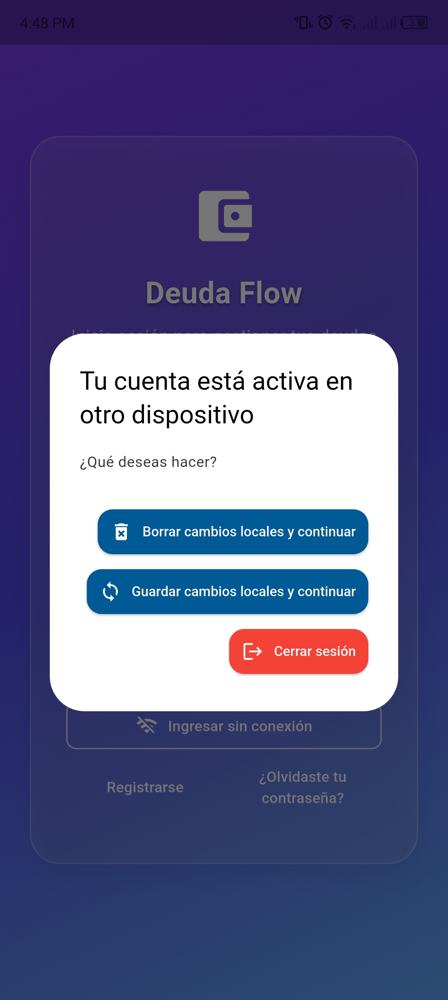
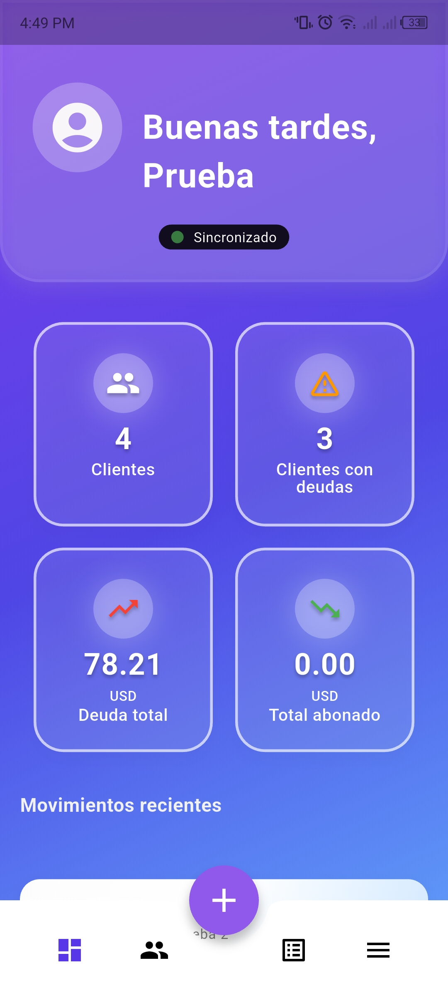

samples, guidance on mobile development, and a full API reference.
# Deuda Flow Flutter

Aplicación Flutter para la gestión de deudas y control de finanzas personales. Permite registrar clientes, transacciones, sincronizar datos entre dispositivos y enviar notificaciones de cobro.

## Características principales

- Registro y gestión de clientes y deudas.
- Sincronización offline/online (Hive y Supabase).
- Envío de notificaciones de cobro vía WhatsApp.
- Control de sesiones por dispositivo.
- Multi-plataforma: Android, iOS, Web y Desktop.
- Interfaz moderna y fácil de usar.

## Capturas de pantalla

Inicio de Sesion:<br>


Control dispositivos:<br>


Pantalla Principal:<br>


Organiza tus deudas:<br>


## Instalación

1. Clona el repositorio:
	```sh
	git clone https://github.com/electro-neo/DeudaFlowFlutter.git
	```
2. Instala dependencias:
	```sh
	flutter pub get
	```
3. Ejecuta la app:
	```sh
	flutter run
	```

## Recursos útiles

- [Documentación oficial de Flutter](https://docs.flutter.dev/)
- [Supabase](https://supabase.com/)
- [Hive](https://docs.hivedb.dev/)

---
¡Contribuciones y sugerencias son bienvenidas!
